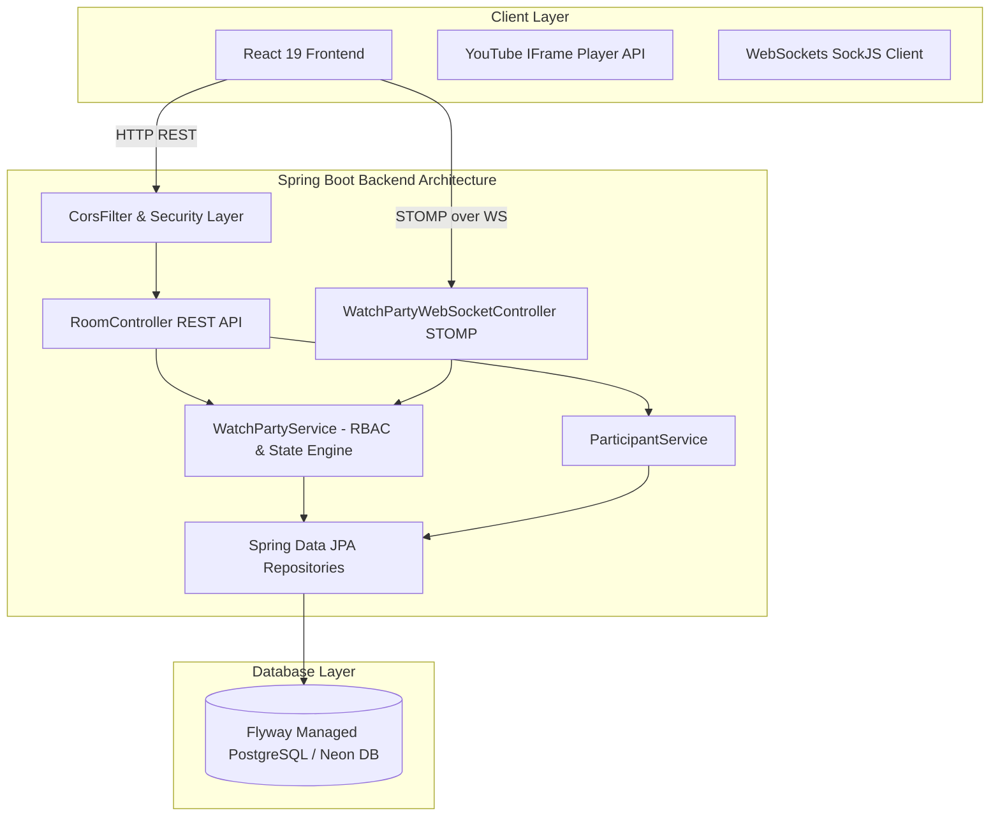
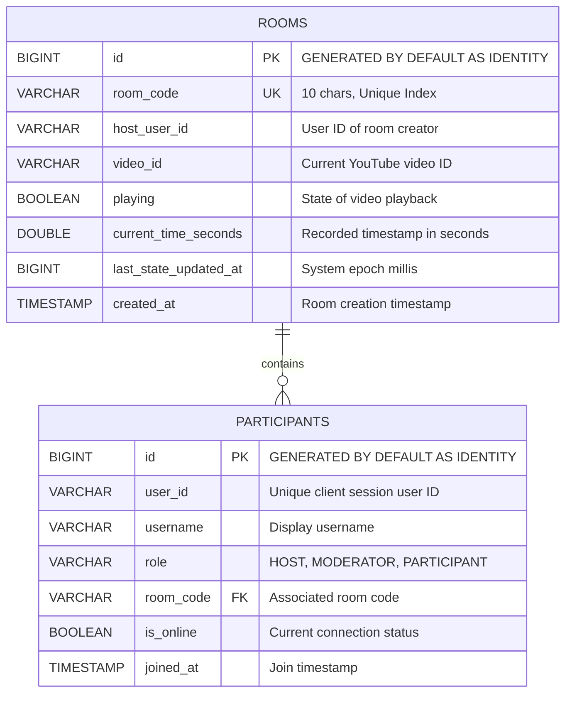
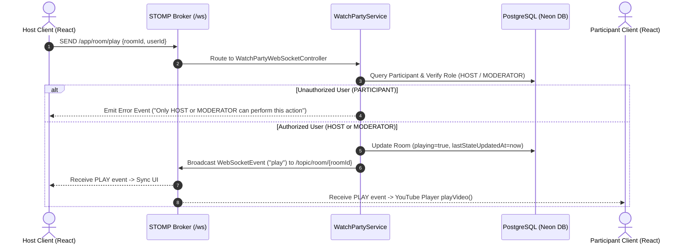
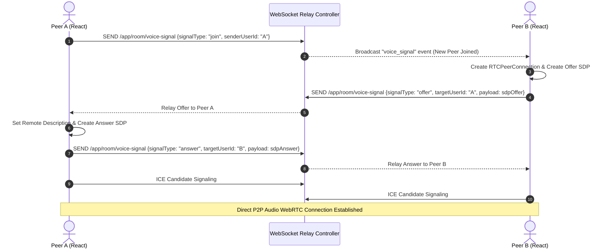
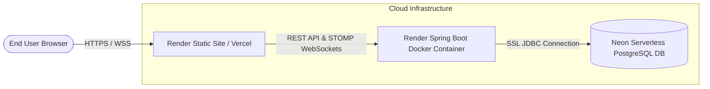

# 🎬 YouTube Watch Party System

> A production-ready, real-time synchronized YouTube Watch Party web application built with **Java 21, Spring Boot 3.3, Flyway Database Migrations, STOMP WebSockets, Spring Data JPA, PostgreSQL (Neon DB), React 19, Vite, and WebRTC Voice Chat**.

---

## 📋 Table of Contents
- [🌟 Key Features](#-key-features)
- [🏗️ System & Backend Architecture](#️-system--backend-architecture)
- [🗄️ Database Architecture & Entity Relationships (ERD)](#️-database-architecture--entity-relationships-erd)
- [🔄 Feature Integration & Workflow Dataflow](#-feature-integration--workflow-dataflow)
- [🛡️ Role-Based Access Control (RBAC) Matrix](#️-role-based-access-control-rbac-matrix)
- [📖 Swagger OpenAPI Documentation](#-swagger-openapi-documentation)
- [📡 REST API & STOMP WebSocket Protocol](#-rest-api--stomp-websocket-protocol)
- [🚀 Deployment Architecture (Neon DB + Render)](#-deployment-architecture-neon-db--render)
- [💻 Local Setup & Development](#-local-setup--development)

---

## 🌟 Key Features

- **🚀 Instant Room Creation**: Generates unique 6-character room codes. Room creator automatically assumes the **HOST** role.
- **⚡ Authoritative Real-Time Sync**: Play, Pause, Seek, and Video Change actions are synchronized across all connected participants instantly via **STOMP WebSockets**.
- **🎙️ Integrated WebRTC Voice Chat**: Real-time peer-to-peer audio voice communication using WebSockets for WebRTC SDP offer/answer/ICE candidate signaling.
- **📜 Flyway Migration & Schema Tracking**: Full version control for PostgreSQL database migrations using Flyway scripts (`V1__init_schema.sql`).
- **🛡️ Server-Authoritative RBAC**:
  - **HOST**: Full video controls, video change, participant role promotion/demotion, user removal, and host transfer.
  - **MODERATOR**: Full video playback controls and video changes.
  - **PARTICIPANT**: Watch-only mode with synchronized playback. All actions are validated authoritatively on the backend.
- **🕒 Smart Live Sync Offset Calculation**: When new participants join an active room, the backend calculates `currentTime + elapsedSeconds` so joining users land on the exact live timestamp without restarting playback.
- **💬 Real-Time Live Chat**: In-room messaging with user avatars and timestamped messages.

---

## 🏗️ System & Backend Architecture

The backend is built as a stateless, high-throughput Spring Boot service designed with layered architecture, separating REST APIs, WebSocket controllers, business logic services, and JPA repositories.



### Core Backend Components:
1. **`WatchPartyWebSocketController`**: Handles inbound STOMP messages over `/app/room/*` (play, pause, seek, change-video, assign-role, remove-participant, chat, voice-signal).
2. **`WatchPartyService`**: Central engine enforcing RBAC policies, updating room state, calculating live sync offsets, and broadcasting events via `SimpMessagingTemplate` to `/topic/room/{roomId}`.
3. **`CorsFilter`**: High-priority global filter ensuring preflight HTTP `OPTIONS` and WebSocket requests pass CORS checks smoothly across origins.
4. **`GlobalExceptionHandler`**: Intercepts domain exceptions (`RoomNotFoundException`, `UnauthorizedActionException`, `MethodArgumentNotValidException`) and maps them to clean HTTP error responses.

---

## 🗄️ Database Architecture & Entity Relationships (ERD)

The database schema is managed via **Flyway Migration Scripts** ([`V1__init_schema.sql`](file:///d:/SystemDesign/YouTubeWatchParty/src/main/resources/db/migration/V1__init_schema.sql)).

### Entity Relationship Diagram (ERD)



### Schema Design & Indexes:
- **`rooms`**:
  - `idx_room_code`: Unique Index on `room_code` for `O(1)` room detail lookup.
- **`participants`**:
  - `idx_user_room`: Unique Index on `(user_id, room_code)` preventing duplicate participant entries per room.
  - `idx_room_code_part`: Non-unique Index on `room_code` for fast filtering of participants inside a room.

---

## 🔄 Feature Integration & Workflow Dataflow

### 1. Synchronized Video Playback Sequence



### 2. WebRTC Voice Chat Signaling Sequence



---

## 🛡️ Role-Based Access Control (RBAC) Matrix

| Permission / Action | HOST | MODERATOR | PARTICIPANT | Backend Enforcement Method |
| :--- | :---: | :---: | :---: | :--- |
| **Watch Synchronized Stream** | ✅ | ✅ | ✅ | Public `/topic/room/{roomId}` broadcast |
| **Play / Pause Video** | ✅ | ✅ | ❌ | `validatePlaybackAuthority()` |
| **Seek Video Timestamp** | ✅ | ✅ | ❌ | `validatePlaybackAuthority()` |
| **Change YouTube Video** | ✅ | ✅ | ❌ | `validatePlaybackAuthority()` |
| **Assign Roles (Promote/Demote)** | ✅ | ❌ | ❌ | `validateHostAuthority()` |
| **Remove Participants** | ✅ | ❌ | ❌ | `validateHostAuthority()` |
| **Send Live Chat & Voice** | ✅ | ✅ | ✅ | Open room participation |

## 📖 Swagger OpenAPI Documentation

Interactive Swagger UI and OpenAPI 3.0 specifications are integrated into the application:

| Environment | Swagger UI Endpoint | OpenAPI JSON Spec |
| :--- | :--- | :--- |
| **Production (Render)** | [https://youtube-watch-party-o8ti.onrender.com/swagger-ui/index.html](https://youtube-watch-party-o8ti.onrender.com/swagger-ui/index.html) | [https://youtube-watch-party-o8ti.onrender.com/v3/api-docs](https://youtube-watch-party-o8ti.onrender.com/v3/api-docs) |
| **Local Development** | [http://localhost:8080/swagger-ui/index.html](http://localhost:8080/swagger-ui/index.html) | [http://localhost:8080/v3/api-docs](http://localhost:8080/v3/api-docs) |

---

## 📡 REST API & STOMP WebSocket Protocol

### REST Endpoints (`/api/rooms`)

| Method | Endpoint | Description | Request Payload | Response |
| :--- | :--- | :--- | :--- | :--- |
| `POST` | `/api/rooms` | Create a new watch room | `{ "username": "Satyam", "initialVideoId": "dQw4w9WgXcQ" }` | `RoomResponse` object |
| `POST` | `/api/rooms/{roomId}/join` | Join existing room | `{ "username": "Alice" }` | `RoomResponse` object |
| `GET` | `/api/rooms/{roomId}` | Fetch room state with live offset | `?userId=user-123` | `RoomResponse` object |
| `GET` | `/api/rooms/{roomId}/participants` | Fetch active participants | N/A | `List<ParticipantDto>` |
| `POST` | `/api/rooms/{roomId}/leave` | Leave room HTTP trigger | `?userId=user-123` | 200 OK |

### STOMP Application Destinations (`/app`)

- `/app/room/join` -> Connect to room session
- `/app/room/leave` -> Leave room session
- `/app/room/play` -> Start video playback
- `/app/room/pause` -> Pause video playback with timestamp
- `/app/room/seek` -> Jump to specific timestamp
- `/app/room/change-video` -> Change YouTube video URL/ID
- `/app/room/assign-role` -> Change participant role (`MODERATOR` / `PARTICIPANT`)
- `/app/room/remove-participant` -> Kick participant from room
- `/app/room/chat` -> Broadcast text message
- `/app/room/voice-signal` -> Relay WebRTC SDP offers/answers & ICE candidates

---

## 🚀 Deployment Architecture (Neon DB + Render)



### Production Environment Variables

#### Backend (`youtube-watch-party-backend` on Render):
```env
PORT=8080
DATABASE_URL=jdbc:postgresql://ep-long-tree-b5dgggum-pooler.c-7.us-east-2.aws.neon.tech/neondb?sslmode=require
DATABASE_USERNAME=neondb_owner
DATABASE_PASSWORD=your_neon_password
FRONTEND_URL=https://youtube-watch-party-frontend-p9ww.onrender.com
```

#### Frontend (`youtube-watch-party-frontend` on Render):
```env
VITE_BACKEND_URL=https://youtube-watch-party-o8ti.onrender.com
```

---

## 💻 Local Setup & Development

### 1. Clone Repository & Setup `.env`
```bash
git clone https://github.com/Satyam0004/YouTube-Watch-Party.git
cd YouTube-Watch-Party
cp .env.example .env
```

### 2. Run Backend & Database via Docker Compose
```bash
docker-compose up --build
```

### 3. Run Frontend (React + Vite)
```bash
cd frontend
npm install
npm run dev
```
Open `http://localhost:5173` in your browser.

### 4. Run Test Suite
```bash
./mvnw clean test
```

---

<p center>Crafted with ❤️ for real-time collaborative watch parties.</p>